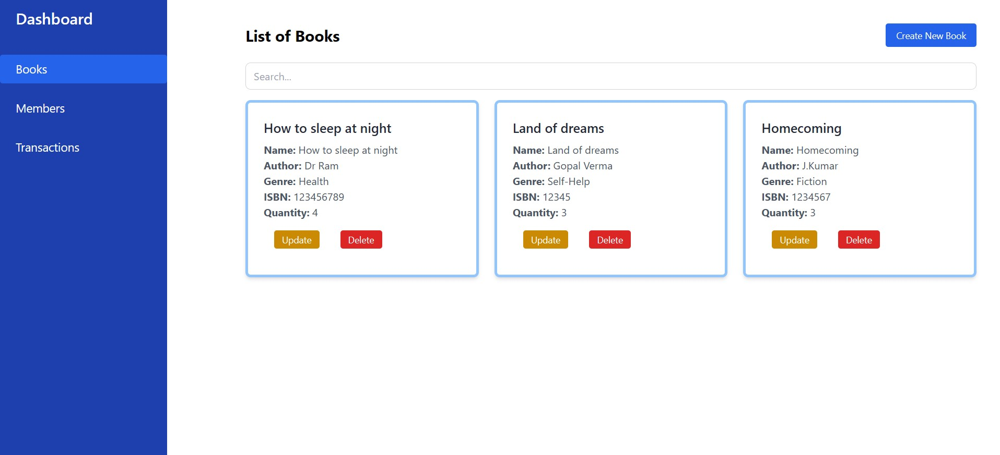
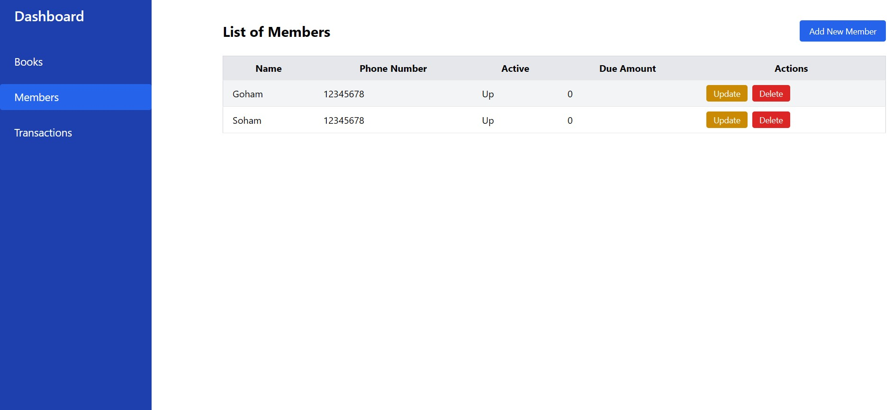
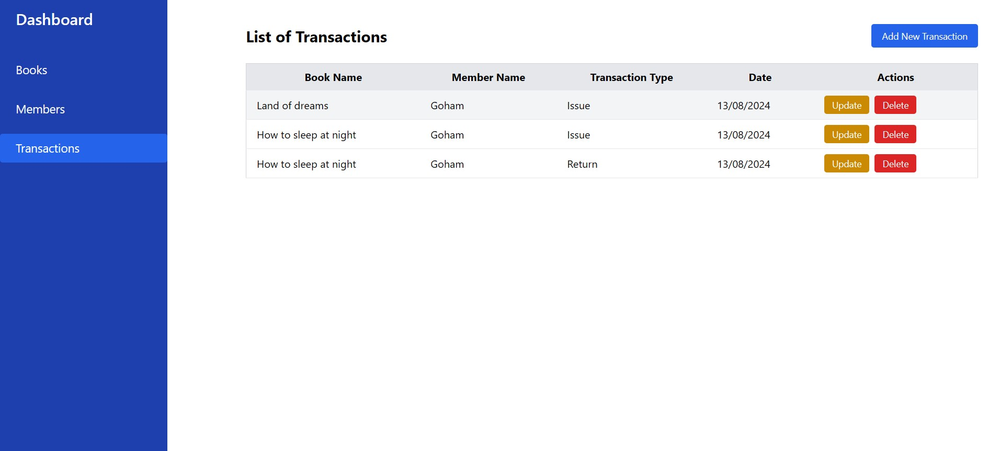
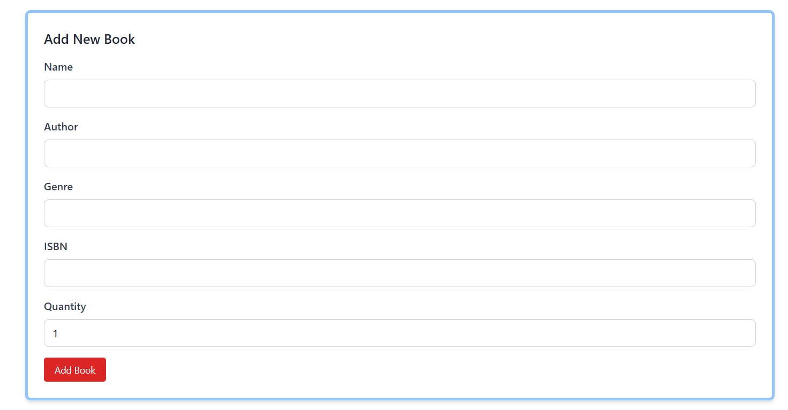

# Blue Library

This is my submission for the dev hiring test at Frappe


## Tech Stack

**Client:** Vue

**Server:** Python(Flask), Mysql


## How to use

To try this project 

Install Python (>=3.10) Mariadb/Mysql,npm/Node 

After that
```bash
    git clone https://github.com/sokumon/blue-lib && cd blue-lib
```
Create DB
```bash
    mysqldump -u [uname] -p libmange> db_backup.sql
```
Create config.py at the root of the project
```python 
import os

class Config:
    SQLALCHEMY_DATABASE_URI = 'mysql+mysqlconnector://<username>:<password>@localhost/libmanage'
    SQLALCHEMY_TRACK_MODIFICATIONS = False
```

Create a venv
```bash
pip install -r requirements.txt
```
Start the app
```bash
python app.py
```

Go to the frontend folder
```bash
npm install && npm run dev
```

# Screenshots

## Books


## Members


## Transaction


## Forms
